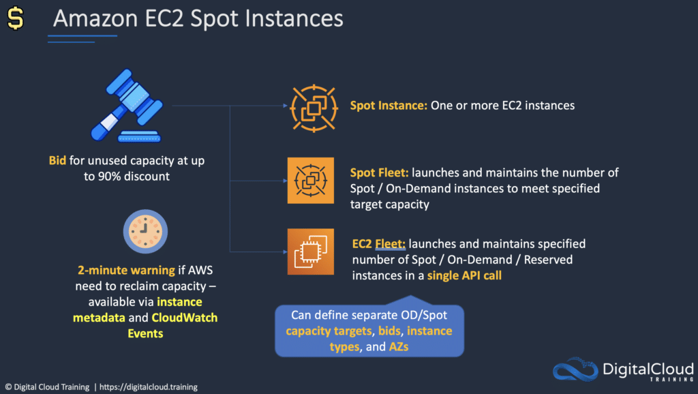
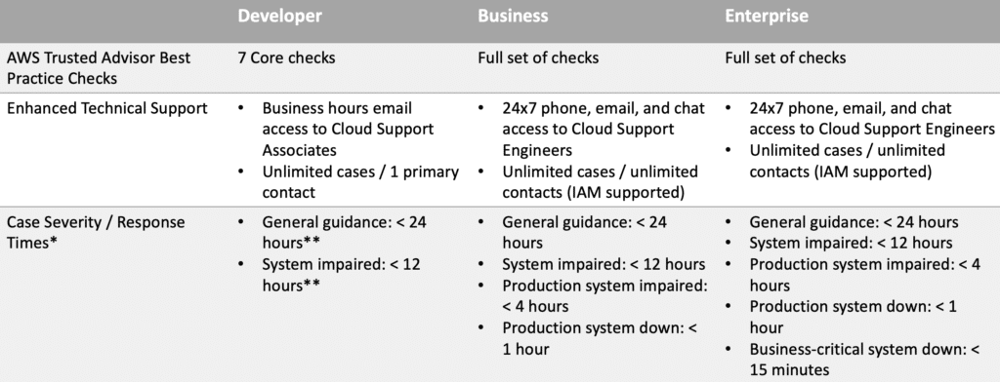
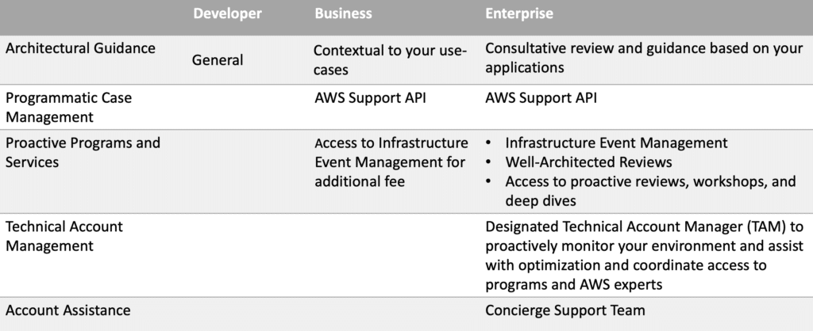
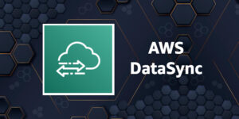

# AWS Billing and Pricing

AWS Billing and Pricing is one of the key subjects on the AWS Certified Cloud Practitioner exam.

AWS works on a pay as you go model in which you only pay for what you use, when you are using it.

If you turn off resources, you don’t pay for them (you may pay for consumed storage).

There are no upfront charges, and you stop paying for a service when you stop using it.

Aside from EC2 reserved instances you are not locked into long term contracts and can terminate whenever you choose to.

Volume discounts are available so the more you use a service the cheaper it gets (per unit used).

There are no termination fees.

The three fundamental drivers of cost with AWS are: compute, storage, and outbound data transfer.

In most cases, there is no charge for inbound data transfer or for data transfer between other AWS services within the
same region (there are some exceptions).

Outbound data transfer is aggregated across services and then charged at the outbound data transfer rate.

Free tier allows you to run certain resources for free.

Free tier includes offers that expire after 12 months and offers that never expire.

Pricing policies include:

* Pay as you go.
* Pay less when you reserve.
* Pay even less per unit when using more.
* Pay even less as AWS grows.
* Custom pricing (enterprise customers only).

Free services include:

* Amazon VPC.
* Elastic Beanstalk (but not the resources created).
* CloudFormation (but not the resources created).
* Identity Access Management (IAM).
* Auto Scaling (but not the resources created).
* OpsWorks.
* Consolidated Billing.

Fundamentally charges include:

1. Compute.
2. Storage.
3. Data out.

## Amazon EC2 pricing

EC2 pricing is based on:

* Clock hours of server uptime.
* Instance configuration.
* Instance type.
* Number of instances.
* Load balancing.
* Detailed monitoring.
* Auto Scaling (resources created).
* Elastic IP addresses (charged if allocated but not used).
* Operating systems and software packages.

There are several pricing model for AWS services, these include:

### On Demand:

Means you pay for compute or database capacity with no long-term commitments of upfront payments.
You pay for the computer capacity per hour or per second (Linux only, and applies to On-Demand, Reserved and Spot
instances).
Recommended for users who prefer low cost and flexibility without upfront payment or long-term commitments.
Good for applications with short-term, spiky, or unpredictable workloads that cannot be interrupted.

### Dedicated Hosts:

A dedicated host is an EC2 servers dedicated to a single customer.
Runs in your VPC.
Good for when you want to leverage existing server-bound software licenses such as Windows Server, SQL Server, and SUSE
Linux Enterprise Server.
Also good for meeting compliance requirements.

### Dedicated Instances:

Dedicated Instances are Amazon EC2 instances that run in a VPC on hardware that’s dedicated to a single customer.
Dedicated instances are physically isolated at the host hardware level from instances that belong to other AWS accounts.
Dedicated instances may share hardware with other instances from the same AWS account that are not Dedicated instances.

### Spot Instances:

Purchase spare computing capacity with no upfront commitment at discounted hourly rates.
Provides up to 90% off the On-Demand price.
Recommended for applications that have flexible start and end times, applications that are only feasible at very low
compute prices, and users with urgent computing needs for a lot of additional capacity.
In the old model Spot instances were terminated because of higher competing bids, in the new model this does not happen,
but instances still may be terminated (with a 2-minute warning) when EC2 needs the capacity back – note: the exam may
not be updated to reflect this yet.

Savings Plans:

Commitment to a consistent amount of usage (EC2 + Fargate + Lambda); Pay by $/hour; 1 or 3-year commitment.
Reservations:

* Reserved instances provide significant discounts, up to 75% compared to On-Demand pricing, by paying for capacity
  ahead
  of time.
* Provide a capacity reservation when applied to a specific Availability Zone.
* Good for applications that have predictable usage, that need reserved capacity, and for customers who can commit to a
  1
  or 3-year term.

Reservations apply to various services, including:

* Amazon EC2 Reserved Instances.
* Amazon DynamoDB Reserved Capacity.
* Amazon ElastiCache Reserved Nodes.
* Amazon RDS Reserved Instances.
* Amazon RedShift Reserved Instances.

Reservation options include no upfront, partial upfront and all upfront.

Reservation terms are 1 or 3 years.

### Amazon Simple Storage Service (S3) Pricing

Storage pricing is determined by:

* **Storage class** – e.g., Standard or IA.
* **Storage quantity** – data volume stored in your buckets on a per GB basis.
* **Number of requests** – the number and type of requests, e.g., GET, PUT, POST, LIST, COPY.
* **Lifecycle transitions requests** – moving data between storage classes.
* **Data transfer** – data transferred out of an S3 region is charged.

### Amazon Glacier pricing

* Extremely low cost and you pay only for what you need with no commitments of upfront fees.
* Charged for requests and data transferred out of Glacier.
* “Amazon Glacier Select” pricing allows queries to run directly on data stored on Glacier without having to retrieve
  the
  archive. Priced on amount of data scanned, returned, and number of requests initiated.

### AWS Snowball Pricing

Pay a service fee per data transfer job and the cost of shipping the appliance.

Each job allows use of Snowball appliance for 10 days onsite for free.

Data transfer in to AWS is free and outbound is charged (per region pricing).

Amazon Relational Database Service (RDS) Pricing

RDS pricing is determined by:

* **Clock hours of server uptime** – amount of time the DB instance is running.
* **Database characteristics** – e.g. database engine, size, and memory class.
* **Database purchase type** – e.g. On-Demand, Reserved.
* **Number of database instances**.
* **Provisioned storage** – backup is included up to 100% of the size of the DB. After the DB is terminated backup
  storage is charged per GB per month.
* **Additional storage** – the amount of storage in addition to the provisioned storage is charged per GB per month.
* **Requests** – the number of input and output requests to the DB.
* **Deployment type** – single AZ or multi-AZ.
* **Data transfer** – inbound is free, outbound data transfer costs are tiered.
* **Reserved Instances** – RDS RIs can be purchased with No Upfront, Partial Upfront, or All Upfront terms. Available
  for Aurora, MySQL, MariaDB, Oracle and SQL Server.

### Amazon CloudFront Pricing

CloudFront pricing is determined by:

* **Traffic distribution** – data transfer and request pricing, varies across regions, and is based on the edge location
  from
* which the content is served.
* **Requests** – the number and type of requests (HTTP or HTTPS) and the geographic region in which they are made.
* **Data transfer out** – quantity of data transferred out of CloudFront edge locations.
* There are additional chargeable items such as invalidation requests, field-level encryption requests, and custom SSL
  certificates.

### AWS Lambda Pricing

Pay only for what you use and charged based on the number of requests for functions and the time it takes to execute
the code.

Price is dependent on the amount of memory allocated to the function.

Amazon Elastic Block Store (EBS) Pricing

Pricing is based on three factors:

* Volumes – volume storage for all EBS volumes type is charged by the amount of GB provisioned per month.
* Snapshots – based on the amount of space consumed by snapshots in S3. Copying snapshots is charged on the amount of
  data copied across regions.
* Data transfer – inbound data transfer is free, outbound data transfer charges are tiered.

### Amazon DynamoDB Pricing

Charged based on:

* Provisioned throughput (write).
* Provisioned throughput (read).
* Indexed data storage.
* Data transfer – no charge for data transfer between DynamoDB and other AWS services within the same region, across
  regions is charged on both sides of the transfer.
* Global tables – charged based on the resources associated with each replica of the table (replicated write capacity
  units, or rWCUs).
* Reserved Capacity – option available for a one-time upfront fee and commitment to paying a minimum usage level at
  specific hourly rates for the duration of the term. Additional throughput is charged at standard rates.

On-demand capacity mode:

* Charged for reads and writes
* No need to specify how much capacity is required
* Good for unpredictable workloads

Provisioned capacity mode:

* Specify number of reads and writes per second
* Can use Auto Scaling
* Good for predictable workloads
* Consistent traffic or gradual changes

### AWS Support Plans

There are four AWS support plans available:

* Basic – billing and account support only (access to forums only).
* Developer – business hours support via email.
* Business – 24×7 email, chat, and phone support.
* Enterprise – 24×7 email, chat, and phone support.

Enterprise support comes with a Technical Account Manager (TAM).

Developer allows one person to open unlimited cases.

Business and Enterprise allow unlimited contacts to open unlimited cases.

### Resource Groups and Tagging

Tags are key / value pairs that can be attached to AWS resources.

Tags contain metadata (data about data).

Tags can sometimes be inherited – e.g. resources created by Auto Scaling, CloudFormation or Elastic Beanstalk.

Resource groups make it easy to group resources using the tags that are assigned to them. You can group resources that
share one or more tags.

Resource groups contain general information, such as:

* Region.
* Name.
* Health Checks.

And specific information, such as:

* Public & private IP addresses (for EC2).
* Port configurations (for ELB).
* Database engine (for RDS).

### AWS Organizations and Consolidated Billing

AWS organizations allows you to consolidate multiple AWS accounts into an organization that you create and centrally
manage.

Available in two feature sets:

* Consolidated Billing.
* All features.

Includes root accounts and organizational units.

Policies are applied to root accounts or OUs.

Consolidated billing includes:

* Paying Account – independent and cannot access resources of other accounts.
* Linked Accounts – all linked accounts are independent.

Consolidated billing has the following benefits:

* One bill – You get one bill for multiple accounts.
* Easy tracking – You can track the charges across multiple accounts and download the combined cost and usage data.
* Combined usage – You can combine the usage across all accounts in the organization to share the volume pricing
  discounts and Reserved Instance discounts. This can result in a lower charge for your project, department, or company
  than with individual standalone accounts.
* No extra fee – Consolidated billing is offered at no additional cost.

Limit of 20 linked accounts (by default).

One bill for multiple AWS accounts.

Easy to track charges and allocate costs.

Volume pricing discounts can be applied to resources.

Billing alerts enabled on the Paying account include data for all Linked accounts (or can be created per Linked
account).

Consolidated billing allows you to get volume discounts on all your accounts.

Unused reserved instances (RIs) for EC2 are applied across the group.

CloudTrail is on a per account basis and per region basis but can be aggregated into a single bucket in the paying
account.

Best practices:

* Always enable multi-factor authentication (MFA) on the root account.
* Always use a strong and complex password on the root account.
* The Paying account should be used for billing purposes only. Do not deploy resources into the Paying account.

## AWS Quick Starts

Quick Starts are built
by [AWS architects](https://digitalcloud.training/certification-training/aws-solutions-architect-associate/) and
partners to help you deploy popular solutions on AWS, based on AWS best practices for security and high availability.

These reference deployments implement key technologies automatically on the AWS Cloud, often with a single click and in
less than an hour.

Leverages CloudFormation.

AWS Cost Calculators and Tools

* AWS Cost Explorer – enables you to visualize your usage patterns over time and to identify your underlying cost
  drivers.
* AWS Pricing Calculator – create cost estimates to suit your AWS use cases.

### AWS Cost Explorer

The AWS Cost Explorer is a free tool that allows you to view charts of your costs.

You can view cost data for the past 13 months and forecast how much you are likely to spend over the next three months.

Cost Explorer can be used to discover patterns in how much you spend on AWS resources over time and to identify cost
problem areas.

Cost Explorer can help you to identify service usage statistics such as:

* Which services you use the most.
* View metrics for which AZ has the most traffic.
* Which linked account is used the most.

### AWS Pricing Calculator

AWS Pricing Calculator is a web-based service that you can use to create cost estimates to suit your AWS use cases.

AWS Pricing Calculator is useful both for people who have never used AWS and for those who want to reorganize or expand
their usage.

AWS Pricing Calculator allows you to explore AWS services based on your use cases and create a cost estimate.

### AWS Cost & Usage Report

Publish AWS billing reports to an Amazon S3 bucket.

Reports break down costs by:

* Hour, day, month, product, product resource, tags.

Can update the report up to three times a day.

Create, retrieve, and delete your reports using the AWS CUR API Reference.

### AWS Price List API

Query the prices of AWS services.

Price List Service API (AKA the Query API) – query with JSON.

AWS Price List API (AKA the Bulk API) – query with HTML.

Alerts via Amazon SNS when prices change.

### AWS Budgets

Used to track cost, usage, or coverage and utilization for your Reserved Instances and Savings Plans, across multiple
dimensions, such as service, or Cost Categories.

Alerting through event-driven alert notifications for when actual or forecasted cost or usage exceeds your budget limit,
or when your RI and Savings Plans’ coverage or utilization drops below your threshold.

Create annual, quarterly, monthly, or even daily budgets depending on your business needs.

Related posts:

