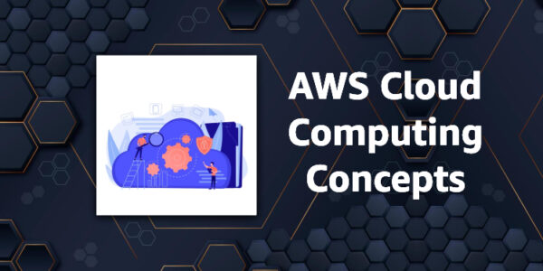
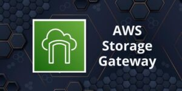

# AWS Cloud Computing Concepts

Cloud computing is the on-demand delivery of compute power, database storage, applications, and other IT resources
through a cloud services platform via the Internet with pay-as-you-go pricing.

Cloud computing provides a simple way to access servers, storage, databases, and a broad set of application services
over the Internet.

The following introductory-level article covers some key AWS concepts that relate to cloud computing:

[What is Cloud Computing? Cloud vs Legacy IT](https://digitalcloud.training/what-is-cloud-computing/)

The following articles provide some additional information around basic computing concepts:

* [Cloud Computing Basics – Compute](https://digitalcloud.training/cloud-computing-basics-compute/)
* [Cloud Computing Basics – Storage](https://digitalcloud.training/cloud-computing-basics-storage/)
* [Cloud Computing Basics – Network](https://digitalcloud.training/cloud-computing-basics-network/)
* [Cloud Computing Basics – Serverless](https://digitalcloud.training/cloud-computing-basics-serverless/)

A cloud services platform such as Amazon Web Services owns and maintains the network-connected hardware required for
these application services, while you provision and use what you need via a web application.

## The 6 Advantages of Cloud

You must understand the following 6 advantages of cloud:

1. Trade capital expense for variable expense.
2. Benefit from massive economies of scale.
3. Stop guessing about capacity.
4. Increase speed and agility.
5. Stop spending money running and maintaining data centers.
6. Go global in minutes.

### Trade capital expense for variable expense

Instead of having to invest heavily in data centers and servers before you know how you’re going to use them, you can
pay only when you consume computing resources, and pay only for how much you consume.

### Benefit from massive economies of scale

By using cloud computing, you can achieve a lower variable cost than you can get on your own. Because usage from
hundreds of thousands of customers is aggregated in the cloud, providers such as AWS can achieve higher economies of
scale, which translates into lower pay as-you-go price.

### Stop guessing about capacity

Eliminate guessing on your infrastructure capacity needs. When you make a capacity decision prior to deploying an
application, you often end up either sitting on expensive idle resources or dealing with limited capacity.

With cloud computing, these problems go away. You can access as much or as little capacity as you need and scale up and
down as required with only a few minutes’ notice.

### Increase speed and agility

In a cloud computing environment, new IT resources are only a click away, which means that you reduce the time to make
those resources available to your developers from weeks to just minutes.

This results in a dramatic increase in agility for the organization since the cost and time it takes to experiment and
develop is significantly lower.

### Stop spending money running and maintaining data centers

Focus on projects that differentiate your business, not the infrastructure. Cloud computing lets you focus on your own
customers, rather than on the heavy lifting of racking, stacking, and powering servers.

### Go global in minutes

Easily deploy your application in multiple regions around the world with just a few clicks. This means you can provide
lower latency and a better experience for your customers at minimal cost.

## Cloud Computing Models

There are 3 common types of cloud computing model that come up in the exam:

1. Infrastructure as a service (IaaS).
2. Platform as a service (PaaS).
3. Software as a service (SaaS).

### Infrastructure as a Service (IaaS)

Infrastructure as a Service (IaaS) contains the basic building blocks for cloud IT and typically provide access to
networking features, computers (virtual or on dedicated hardware), and data storage space.

IaaS provides you with the highest level of flexibility and management control over your IT resources and is very
similar to the existing IT resources that many IT departments and developers are familiar with today.

### Platform as a Service (PaaS)

Platform as a Service (PaaS) removes the need for your organization to manage the underlying infrastructure (usually
hardware and operating systems) and allows you to focus on the deployment and management of your applications.

This helps you be more efficient as you don’t need to worry about resource procurement, capacity planning, software
maintenance, patching, or any of the other undifferentiated heavy lifting involved in running your application.

### Software as a Service (SaaS)

Software as a Service (SaaS) provides you with a completed product that is run and managed by the service provider. In
most cases, people referring to Software as a Service are referring to end-user applications.

With a SaaS offering you do not have to think about how the service is maintained or how the underlying infrastructure
is managed; you only need to think about how you will use that piece of software.

A common example of a SaaS application is web-based email which you can use to send and receive email without having to
manage feature additions to the email product or maintain the servers and operating systems that the email program is
running on.

SaaS provides high availability, fault tolerance, scalability an elasticity.

The following article provides some additional information:

[Cloud Computing Service Models – IaaS, PaaS, SaaS](https://digitalcloud.training/cloud-computing-service-models-iaas-paas-saas/)

## Types of Cloud Deployment

There are 3 common types of cloud deployment that come up in the exam:

1. Public Cloud – e.g. AWS, Microsoft Azure, Google Cloud Platform (GCP).
2. Hybrid Cloud – a mixture of public and private clouds.
3. Private Cloud (on-premises) – a cloud managed in your own data center, e.g. Hyper-V, OpenStack, VMware.

### Public Cloud

A cloud-based application is fully deployed in the cloud and all parts of the application run in the cloud. Applications
in the cloud have either been created in the cloud or have been migrated from an existing infrastructure to take
advantage of the benefits of cloud computing.

Cloud-based applications can be built on low-level infrastructure pieces or can use higher level services that provide
abstraction from the management, architecting, and scaling requirements of core infrastructure.

### Hybrid

A hybrid deployment is a way to connect infrastructure and applications between cloud-based resources and existing
resources that are not located in the cloud.

The most common method of hybrid deployment is between the cloud and existing on-premises infrastructure to extend, and
grow, an organization’s infrastructure into the cloud while connecting cloud resources to the internal system.

### On-premises

The deployment of resources on-premises, using virtualization and resource management tools, is sometimes called the
“private cloud.”

On-premises deployment doesn’t provide many of the benefits of cloud computing but is sometimes sought for its ability
to provide dedicated resources.

In most cases this deployment model is the same as legacy IT infrastructure while using application management and
virtualization technologies to try and increase resource utilization.

The following article provides some additional information:

[Cloud Computing Deployment Models – Public, Private & Hybrid](https://digitalcloud.training/cloud-computing-deployment-models/)

Related posts:

