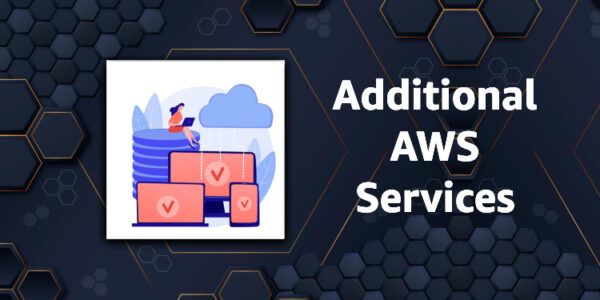

# AWS Global Infrastructure

This article covers AWS Global Infrastructure training which is a key technology area covered in the Cloud Practitioner
exam blueprint. The AWS infrastructure is built around Regions and Availability Zones (AZs).

An AWS Region is a physical location in the world where AWS have multiple AZs.

AZs consist of one or more discrete data centers, each with redundant power, networking, and connectivity, housed in
separate facilities.

Each region is completely independent. Each Availability Zone is isolated, but the Availability Zones in a region are
connected through low-latency links.

AWS are constantly expanding around the world and currently there are:

## Regions

A region is a geographical area.

Each region consists of 3 or more availability zones.

Each Amazon Region is designed to be completely isolated from the other Amazon Regions.

Each AWS Region has multiple Availability Zones and data centers.

You can replicate data within a region and between regions using private or public Internet connections.

You retain complete control and ownership over the region in which your data is physically located, making it easy to
meet regional compliance and data residency requirements.

Note that there is a charge for data transfer between regions.

When you launch an EC2 instance, you must select an AMI that’s in the same region. If the AMI is in another region, you
can copy the AMI to the region you’re using.

Regions and Endpoints:

* When you work with an instance using the command line interface or API actions, you must specify its regional
  endpoint.
* To reduce data latency in your applications, most Amazon Web Services offer a regional endpoint to make your requests.
* An endpoint is a URL that is the entry point for a web service.
* For example, https://dynamodb.us-west-2.amazonaws.com is an entry point for the Amazon DynamoDB service.

## Availability Zones

Availability Zones are physically separate and isolated from each other.

AZs span one or more data centers and have direct, low-latency, high throughput, and redundant network connections
between each other.

Each AZ is designed as an independent failure zone.

When you launch an instance, you can select an Availability Zone or let AWS choose one for you.

If you distribute your EC2 instances across multiple Availability Zones and one instance fails, you can design your
application so that an instance in another Availability Zone can handle requests.

You can also use Elastic IP addresses to mask the failure of an instance in one Availability Zone by rapidly remapping
the address to an instance in another Availability Zone.

An Availability Zone is represented by a region code followed by a letter identifier; for example, us-east-1a.

To ensure that resources are distributed across the Availability Zones for a region, AWS independently map Availability
Zones to names for each AWS account.

For example, the Availability Zone us-east-1a for your AWS account might not be the same location as us-east-1a for
another AWS account.

To coordinate Availability Zones across accounts, you must use the AZ ID, which is a unique and consistent identifier
for an Availability Zone.

AZs are physically separated within a typical metropolitan region and are in lower risk flood plains.

AZs use discrete UPS and onsite backup generation facilities and are fed via different grids from independent
facilities.

AZs are all redundantly connected to multiple tier-1 transit providers.

The following graphic shows three AWS Regions each of which has three Availability Zones:

## Local Zones

AWS Local Zones place compute, storage, database, and other select AWS services closer to end-users.

With AWS Local Zones, you can easily run highly demanding applications that require single-digit millisecond latencies
to your end-users.

Each AWS Local Zone location is an extension of an AWS Region where you can run your latency sensitive applications
using AWS services such as Amazon Elastic Compute Cloud, Amazon Virtual Private Cloud, Amazon Elastic Block Store,
Amazon File Storage, and Amazon Elastic Load Balancing in geographic proximity to end-users.

AWS Local Zones provide a high-bandwidth, secure connection between local workloads and those running in the AWS Region,
allowing you to seamlessly connect to the full range of in-region services through the same APIs and tool sets.

## AWS Wavelength

AWS Wavelength enables developers to build applications that deliver single-digit millisecond latencies to mobile
devices and end-users.

AWS developers can deploy their applications to Wavelength Zones, AWS infrastructure deployments that embed AWS compute
and storage services within the telecommunications providers’ datacenters at the edge of the 5G networks, and seamlessly
access the breadth of AWS services in the region.

AWS Wavelength brings AWS services to the edge of the 5G network, minimizing the latency to connect to an application
from a mobile device.

## AWS Outposts

AWS Outposts bring native AWS services, infrastructure, and operating models to virtually any data center, co-location
space, or on-premises facility.

You can use the same AWS APIs, tools, and infrastructure across on-premises and the AWS cloud to deliver a truly
consistent hybrid experience.

AWS Outposts is designed for connected environments and can be used to support workloads that need to remain on-premises
due to low latency or local data processing needs.

## Edge Locations and Regional Edge Caches

Edge locations are Content Delivery Network (CDN) endpoints for CloudFront.

There are many more edge locations than regions.

Currently there are over 200 edge locations.

Regional Edge Caches sit between your CloudFront Origin servers and the Edge Locations.

A Regional Edge Cache has a larger cache-width than each of the individual Edge Locations.

The following diagram shows CloudFront Edge locations:

Related posts:

