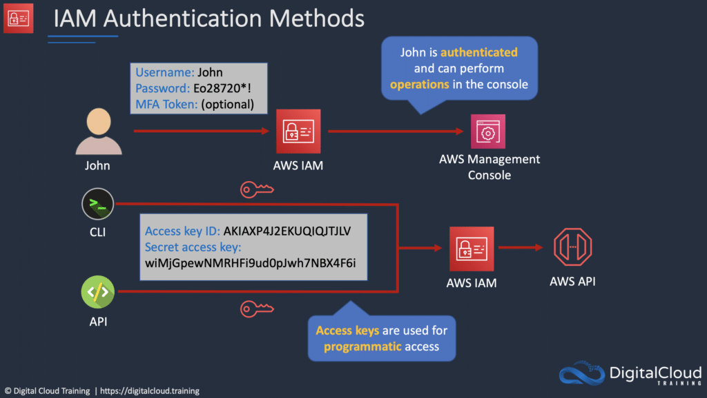

# AWS Identity and Access Management

AWS Identity and Access Management (IAM) is a powerful service that allows users to securely manage access to AWS
resources.

IAM is a central component of AWS security, enabling administrators to control who can access what resources, and how.

Amazon IAM also provides a range of features to help organizations meet security and compliance requirements, such as
multi-factor authentication and role-based access control.

Learn about the key features and benefits of AWS IAM and how it can help businesses improve their security posture in
the cloud.

## What is AWS IAM?

AWS Identity and Access Management (IAM) is a web service that helps you securely control access to AWS resources.

You use IAM to control who is authenticated (signed in) and authorized (has permissions) to use resources. Think of IAM
as the control center to all AWS resources.

IAM makes it easy to provide multiple users secure access to AWS resources.

When you first create an AWS account, you begin with a single sign-in identity that has complete access to all AWS
services and resources in the account.

This identity is called the AWS account root user and is accessed by signing in with the email address and password that
you used to create the account.

IAM can be used to manage:

* Users.
* Groups.
* Access policies.
* Roles.
* User credentials.
* User password policies.
* Multi-factor authentication (MFA).
* API keys for programmatic access (CLI).

IAM provides the following features:

* Shared access to your AWS account.
* Granular permissions.
* Secure access to AWS resources for application that run on Amazon EC2.
* Multi-Factor authentication.
* Identity federation.
* Identity information for assurance.
* PCI DSS compliance.
* Integrated with many AWS services.
* Eventually consistent.
* Free to use.

You can work with AWS Identity and Access Management in any of the following ways:

* AWS Management Console.
* AWS Command Line Tools.
* AWS SDKs.
* IAM HTTPS API.

By default new users are created with NO access to any AWS services – they can only login to the AWS console.

Permission must be explicitly granted to allow a user to access an AWS service.

IAM users are individuals who have been granted access to an AWS account.

Each IAM user has three main components:

* A username.
* A password.
* Permissions to access various resources.

You can apply granular permissions with IAM.

You can assign users individual security credentials such as access keys, passwords, and multi-factor authentication
devices.

IAM is not used for application-level authentication.

Identity Federation (including AD, Facebook etc.) can be configured allowing secure access to resources in an AWS
account without creating an IAM user account.

Multi-factor authentication (MFA) can be enabled/enforced for the AWS account and for individual users under the
account.

MFA uses an authentication device that continually generates random, six-digit, single-use authentication codes.

You can authenticate using an MFA device in the following two ways:

* Through the AWS Management Console – the user is prompted for a user name, password, and authentication code.
* Using the AWS API – restrictions are added to IAM policies and developers can request temporary security credentials
  and pass MFA parameters in their AWS STS API requests.
* Using the AWS CLI by obtaining temporary security credentials from STS (aws sts get-session-token).

It is a best practice to always setup multi-factor authentication on the root account.

IAM is universal (global) and does not apply to regions.

IAM replicates data across multiple data centers around the world.

The “root account” is the account created when you setup the AWS account. It has complete Admin access and is the only
account that has this access by default.

It is a best practice to avoid using the root account for anything other than billing.

Power user access allows all permissions except the management of groups and users in IAM.

Temporary security credentials consist of the AWS access key ID, secret access key, and security token.

IAM can assign temporary security credentials to provide users with temporary access to services/resources.

To sign-in you must provide your account ID or account alias in addition to a user name and password.

The sign-in URL includes the account ID or account alias, e.g.:

https://My_AWS_Account_ID.signin.aws.amazon.com/console/

Alternatively, you can sign-in at the following URL and enter your account ID or alias manually:

https://console.aws.amazon.com/

IAM integrates with many different AWS services.

Authentication Methods

Console password:

* A password that the user can enter to sign in to interactive sessions such as the AWS Management Console.
* You can allow users to change their own passwords.
* You can allow selected IAM users to change their passwords by disabling the option for all users and using an IAM
  policy to grant permissions for the selected users.

Access Keys:

* A combination of an access key ID and a secret access key.
* You can assign two active access keys to a user at a time.
* These can be used to make programmatic calls to AWS when using the API in program code or at a command prompt when
  using the AWS CLI or the AWS PowerShell tools.
* You can create, modify, view, or rotate access keys.
* When created IAM returns the access key ID and secret access key.
* The secret access is returned only at creation time and if lost a new key must be created.
* Ensure access keys and secret access keys are stored securely.
* Users can be given access to change their own keys through IAM policy (not from the console).
* You can disable a user’s access key which prevents it from being used for API calls.

Server certificates:

* SSL/TLS certificates that you can use to authenticate with some AWS services.
* AWS recommends that you use the AWS Certificate Manager (ACM) to provision, manage and deploy your server
  certificates.
* Use IAM only when you must support HTTPS connections in a region that is not supported by ACM.

## IAM Users

An IAM user is an entity that represents a person or service.

Can be assigned:

* An access key ID and secret access key for programmatic access to the AWS API, CLI, SDK, and other development tools.
* A password for access to the management console.

By default, users cannot access anything in your account.

The account root user credentials are the email address used to create the account and a password.

The root account has full administrative permissions, and these cannot be restricted.

Best practice for root accounts:

* Don’t use the root user credentials.
* Don’t share the root user credentials.
* Create an IAM user and assign administrative permissions as required.
* Enable MFA.

IAM users can be created to represent applications, and these are known as “service accounts”.

You can have up to 5000 users per AWS account.

Each user account has a friendly name and an ARN which uniquely identifies the user across AWS.

A unique ID is also created which is returned only when you create the user using the API, Tools for Windows PowerShell,
or the AWS CLI.

You should create individual IAM accounts for users (best practice not to share accounts).

The Access Key ID and Secret Access Key are not the same as a password and cannot be used to login to the AWS console.

The Access Key ID and Secret Access Key can only be used once and must be regenerated if lost.

A password policy can be defined for enforcing password length, complexity etc. (applies to all users).

You can allow or disallow the ability to change passwords using an IAM policy.

Access keys and passwords should be changed regularly.

## Groups

Groups are collections of users and have policies attached to them.

A group is not an identity and cannot be identified as a principal in an IAM policy.

Use groups to assign permissions to users.

Use the principle of least privilege when assigning permissions.

You cannot nest groups (groups within groups).

## Roles

Roles are created and then “assumed” by trusted entities and define a set of permissions for making AWS service
requests.

With IAM Roles you can delegate permissions to resources for users and services without using permanent credentials (
e.g. user name and password).

IAM users or AWS services can assume a role to obtain temporary security credentials that can be used to make AWS API
calls.

You can delegate using roles.

There are no credentials associated with a role (password or access keys).

IAM users can temporarily assume a role to take on permissions for a specific task.

A role can be assigned to a federated user who signs in using an external identity provider.

Temporary credentials are primarily used with IAM roles and automatically expire.

Roles can be assumed temporarily through the console or programmatically with the AWS CLI, Tools for Windows PowerShell,
or the API.

IAM roles with EC2 instances:

* IAM roles can be used for granting applications running on EC2 instances permissions to AWS API requests using
  instance profiles.
* Only one role can be assigned to an EC2 instance at a time.
* A role can be assigned at the EC2 instance creation time or at any time afterwards.
* When using the AWS CLI or API instance profiles must be created manually (it’s automatic and transparent through the
  console).
* Applications retrieve temporary security credentials from the instance metadata.

Role Delegation:

* Create an IAM role with two policies:
*
    * Permissions policy – grants the user of the role the required permissions on a resource.
*
    * Trust policy – specifies the trusted accounts that are allowed to assume the role.
* Wildcards (*) cannot be specified as a principal.
* A permissions policy must also be attached to the user in the trusted account.

## Policies

Policies are documents that define permissions and can be applied to users, groups, and roles.

Policy documents are written in JSON (key value pair that consists of an attribute and a value).

All permissions are implicitly denied by default.

The most restrictive policy is applied.

The IAM policy simulator is a tool to help you understand, test, and validate the effects of access control policies.

The Condition element can be used to apply further conditional logic.

## Comparing AWS IAM Role vs Policy vs Group

In AWS IAM, roles, policies, and groups are all used to manage access to AWS resources.

A role defines a set of permissions and access policies that determine what actions a user or AWS service can take.
Roles are useful when you want to grant (temporary) access to AWS resources to a third-party entity, such as an AWS
service or a user outside of your AWS account.

A policy, on the other hand, is a document that defines a set of permissions and specifies which AWS resources those
permissions grant access to. Policies can be attached to roles, groups, or individual users to define their level of
access to AWS resources. Policies are useful when you want to define and enforce specific permissions for a particular
resource or set of resources.

A group is a collection of users that share common permissions. Groups make it easy to manage permissions for multiple
users at once, as policies can be attached to a group and apply to all users within that group. By assigning permissions
to a group, you can grant or revoke access for multiple users with a single action.

Overall, roles are used to grant access to specific resources or services, policies are used to define the permissions
for those resources or services, and groups are used to organize and manage multiple users with similar permissions.
Overall, roles, policies, and groups are all critical components of AWS IAM, each serving a unique purpose in managing
user access to AWS resources.

## AWS Security Token Service (AWS STS)

The AWS STS is a web service that enables you to request temporary, limited-privilege credentials for IAM users or for
users that you authenticate (federated users).

Temporary security credentials work almost identically to long-term access key credentials that IAM users can use, with
the following differences:

* Temporary security credentials are short-term.
* They can be configured to last anywhere from a few minutes to several hours.
* After the credentials expire, AWS no longer recognizes them or allows any kind of access to API requests made with
  them.
* Temporary security credentials are not stored with the user but are generated dynamically and provided to the user
  when requested.
* When (or even before) the temporary security credentials expire, the user can request new credentials, if the user
  requesting them still has permission to do so.

Advantages of STS are:

* You do not have to distribute or embed long-term AWS security credentials with an application.
* You can provide access to your AWS resources to users without having to define an AWS identity for them (temporary
  security credentials are the basis for IAM Roles and ID Federation).
* The temporary security credentials have a limited lifetime, so you do not have to rotate them or explicitly revoke
  them when they’re no longer needed.
* After temporary security credentials expire, they cannot be reused (you can specify how long the credentials are valid
  for, up to a maximum limit)

Users can come from three sources.

1. Federation (typically AD):

* Uses SAML 2.0.
* Grants temporary access based on the users AD credentials.
* Does not need to be a user in IAM.
* Single sign-on allows users to login to the AWS console without assigning IAM credentials.

1. Federation with Mobile Apps:

* Use Facebook/Amazon/Google or other OpenID providers to login.

1. Cross Account Access:

* Allows users from one AWS account access resources in another.
* To make a request in a different account the resource in that account must have an attached resource-based policy with
  the permissions you need.
* Or you must assume a role (identity-based policy) within that account with the permissions you need.

## IAM Best Practices

Lock away the AWS root user access keys.

Create individual IAM users.

Use AWS defined policies to assign permissions whenever possible.

Use groups to assign permissions to IAM users.

Grant least privilege.

Use access levels to review IAM permissions.

Configure a strong password policy for users.

Enable MFA.

Use roles for applications that run on AWS EC2 instances.

Delegate by using roles instead of sharing credentials.

Rotate credentials regularly.

Remove unnecessary credentials.

Use policy conditions for extra security.

Monitor activity in your AWS account.

## Interaction with IAM in cloud jobs

Many different roles in the technology industry will interact with AWS IAM directly or indirectly. If your organization
uses AWS, you will be given different roles in order to access the services necessary to succeed at your job.

* Users with Admin access will be the ones defining users, groups, and roles. They will use IAM very often to manage the
  entire organization’s access.
* Developers will make calls to AWS services in order to make their programs run. They will leverage a set of access
  keys and secret keys in their application development.
* Database Admins will have a set of permissions that allows them to manipulate different AWS databases. They need the
  appropriate roles to allow this access.
* System Admins will maintain infrastructure in AWS. They will need the appropriate permissions to create new resources.

Any role you take in a corporation that uses AWS, you will run into IAM. It is the backbone of AWS.

## AWS Certifications and IAM

IAM is the building block of AWS. This will come up on nearly every AWS exam in one way or another. There are many
questions on every associate exam that involve services taking on different IAM roles. While IAM is not an extremely
difficult topic to master, understanding it in depth will set a great foundation for the rest of your learning on AWS!

### Learn More

If you’re keen to deepen your understanding of AWS IAM, check out the popular AWS Identity Management Masterclass from
Digital Cloud Training which includes both theory lessons and practical hands-on labs.

Related posts:

