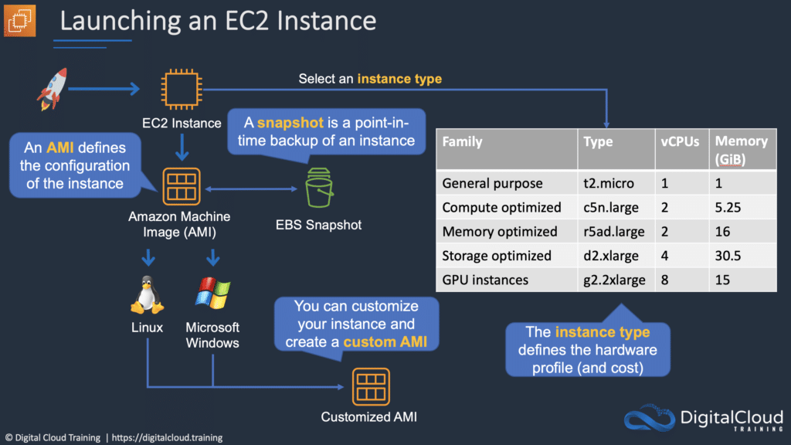
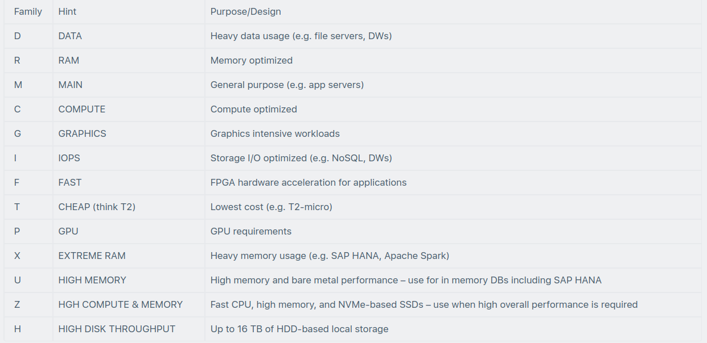
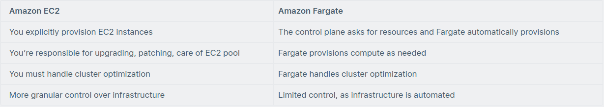
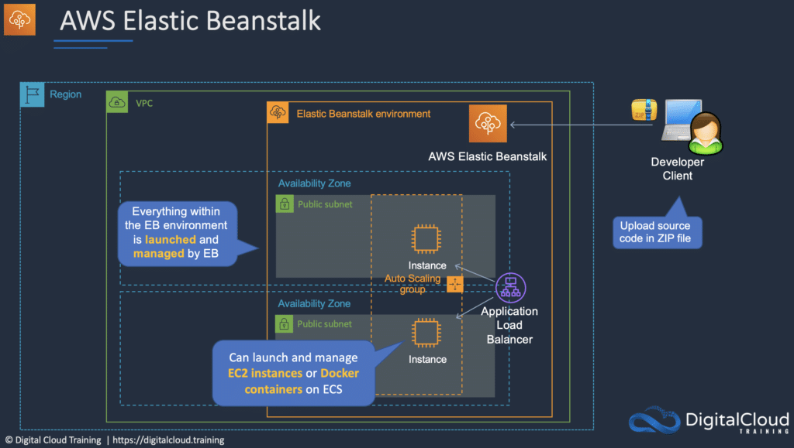

# AWS Compute Services

This article discusses AWS Compute in the context of the AWS Certified Cloud Practitioner Exam. This is one of the key
technology areas covered in the exam guide.

## Amazon EC2

Amazon Elastic Compute Cloud (Amazon EC2) is a web service with which you can run virtual server “instances” in the
cloud.

Amazon EC2 instances can run the Windows, Linux, or MacOS operating systems.

The EC2 simple web service interface allows you to obtain and configure capacity with minimal friction.

EC2 is designed to make web-scale cloud computing easier for developers.

Amazon EC2 changes the economics of computing by allowing you to pay only for capacity that you use.

Amazon EC2 provides developers the tools to build failure resilient applications and isolate them from common failure
scenarios.

Benefits of EC2 include:

* Elastic Web-Scale computing – you can increase or decrease capacity within minutes not hours and commission one to
  thousands of instances simultaneously.
* Completely controlled – You have complete control include root access to each instance and can stop and start
  instances without losing data and using web service APIs.
* Flexible Cloud Hosting Services – you can choose from multiple instance types, operating systems, and software
  packages as well as instances with varying memory, CPU, and storage configurations.
* Integrated – EC2 is integrated with most AWS services such as S3, RDS, and VPC to provide a complete, secure solution.
* Reliable – EC2 offers a highly reliable environment where replacement instances can be rapidly and predictably
  commissioned with SLAs of 99.99% for each region.
* Secure – EC2 works in conjunction with VPC to provide a secure location with an IP address range you specify and
  offers Security Groups, Network ACLs, and IPSec VPN features.
* Inexpensive – Amazon passes on the financial benefits of scale by charging very low rates and on a capacity consumed
  basis.

An Amazon Machine Image (AMI) is a special type of virtual appliance that is used to create a virtual machine within the
Amazon Elastic Compute Cloud (“EC2”).

An AMI includes the following:

* One or more EBS snapshots, or, for instance-store-backed AMIs, a template for the root volume of the instance (for
  example, an operating system, an application server, and applications).
* Launch permissions that control which AWS accounts can use the AMI to launch instances.
* A block device mapping that specifies the volumes to attach to the instance when it’s launched.

AMIs come in three main categories:

* Community AMIs – free to use, generally you just select the operating system you want.
* AWS Marketplace AMIs – pay to use, generally come packaged with additional, licensed software.
* My AMIs – AMIs that you create yourself.

Metadata and User Data:

* User data is data that is supplied by the user at instance launch in the form of a script.
* Instance metadata is data about your instance that you can use to configure or manage the running instance.
* User data is limited to 16KB.
* User data and metadata are not encrypted.
* Instance metadata is available at http://169.254.169.254/latest/meta-data.

The Instance Metadata Query tool allows you to query the instance metadata without having to type out the full URI or
category names.

## Pricing

### On-demand:

* Good for users that want the low cost and flexibility of EC2 without any up-front payment or long-term commitment.
* Applications with short term, spiky, or unpredictable workloads that cannot be interrupted.
* Applications being developed or tested on EC2 for the first time.

### Reserved:

* Applications with steady state or predictable usage.
* Applications that require reserved capacity.
* Users can make up-front payments to reduce their total computing costs even further.
* Standard Reserved Instances (RIs) provide up to 75% off on-demand price.
* Convertible RIs provide up to 54% off on-demand price – provides the capability to change the attributes of the RI if
  the exchange results in the creation of RIs of equal or greater value.
* Scheduled RIs are available to launch within the time window you reserve. This option allows you to match your
  capacity reservation to a predictable recurring schedule that only requires a fraction of a day, a week, or a month.

### Spot:

* Applications that have flexible start and end times.
* Applications that are only feasible at very low compute prices.
* Users with an urgent need for a large amount of additional compute capacity.
* If Amazon terminate your instances you do not pay, if you terminate you pay for the hour.

### Dedicated hosts:

* Physical servers dedicated just for your use.
* You then have control over which instances are deployed on that host.
* Available as On-Demand or with Dedicated Host Reservation.
* Useful if you have server-bound software licenses that use metrics like per-core, per-socket, or per-VM.
* Each dedicated host can only run one EC2 instance size and type.
* Good for regulatory compliance or licensing requirements.
* Predictable performance.
* Complete isolation.
* Most expensive option.
* Billing is per host.

### Dedicated instances:

* Virtualized instances on hardware just for you.
* Also uses physically dedicated EC2 servers.
* Does not provide the additional visibility and controls of dedicated hosts (e.g. how instances are placed on a
  server).
* Billing is per instance.
* May share hardware with other non-dedicated instances in the same account.
* Available as On-Demand, Reserved Instances, and Spot Instances.
* Cost additional $2 per hour per region.

### Savings Plans:

* Savings Plans is a flexible pricing model that provides savings of up to 72% on your AWS compute usage.
* This pricing model offers lower prices on Amazon EC2 instances usage, regardless of instance family, size, OS,
  tenancy, or AWS Region.
* Also applies to AWS Fargate and AWS Lambda usage.

### Instance Types

Amazon EC2 provides a wide selection of instance types optimized to fit different use cases.

Instance types comprise varying combinations of CPU, memory, storage, and networking capacity and give you the
flexibility to choose the appropriate mix of resources for your applications.

Each instance type includes one or more instance sizes, allowing you to scale your resources to the requirements of your
target workload.

The table below helps you to understand some of the various EC2 instance families and their intended use case:

### Amazon Elastic Container Service (ECS)

Amazon Elastic Container Service (ECS) is another product in the AWS Compute category. It provides a highly scalable,
high performance container management service that supports Docker containers and allows you to easily run applications
on a managed cluster of Amazon EC2 instances.

Amazon ECS eliminates the need for you to install, operate, and scale your own cluster management infrastructure.

Using API calls you can launch and stop container-enabled applications, query the complete state of clusters, and access
many familiar features like security groups, Elastic Load Balancing, EBS volumes and IAM roles.

Amazon ECS can be used to schedule the placement of containers across clusters based on resource needs and availability
requirements.

An Amazon ECS launch type determines the type of infrastructure on which your tasks and services are hosted.

There are two launch types, and the table below describes some of the differences between the two launch types:

The Elastic container registry (ECR) is a managed AWS Docker registry service for storing, managing, and deploying
Docker images.

There is no additional charge for Amazon ECS. You pay for AWS resources (e.g. EC2 instances or EBS volumes) you create
to store and run your application.

Amazon ECR is integrated with Amazon EC2 Container Service (ECS).

With Amazon ECR, there are no upfront fees or commitments. You pay only for the amount of data you store in your
repositories and data transferred to the Internet.

### AWS Lambda

AWS Lambda is a serverless computing technology that allows you to run code without provisioning or managing servers.

AWS Lambda executes code only when needed and scales automatically.

You pay only for the compute time you consume (you pay nothing when your code is not running).

Benefits of AWS Lambda:

* No servers to manage.
* Continuous scaling.
* Millisecond billing.
* Integrates with almost all other AWS services.

Primary use cases for AWS Lambda:

* Data processing.
* Real-time file processing.
* Real-time stream processing.
* Build serverless backends for web, mobile, IOT, and 3rd party API requests.

### Amazon LightSail

Amazon LightSail Instances

Amazon LightSail is one of the newest services in the AWS Compute suite of products. Amazon LightSail is great for users
who do not have deep AWS technical expertise as it makes it very easy to provision compute services.

Amazon LightSail provides developers compute, storage, and networking capacity and capabilities to deploy and manage
websites, web applications, and databases in the cloud.

Amazon LightSail includes everything you need to launch your project quickly – a virtual machine, SSD-based storage,
data transfer, DNS management, and a static IP.

Amazon LightSail provides preconfigured virtual private servers (instances) that include everything required to deploy
and application or create a database.

The underlying infrastructure and operating system is managed by Amazon LightSail.

Best suited to projects that require a few dozen instances or fewer.

Provides a simple management interface.

Good for blogs, websites, web applications, e-commerce etc.

Can deploy load balancers and attach block storage.

Public API.

Limited to 20 Amazon LightSail instances, 5 static IPs, 3 DNS zones, 20 TB block storage, 40 databases, and 5 load
balancers per account.

Up to 20 certificates per calendar year.

Can connect to each other and other AWS resources through public Internet and private (VPC peering) networking.

Application templates include WordPress, WordPress Multisite, Drupal, Joomla!, Magento, Redmine, LAMP, Nginx (LEMP),
MEAN, Node.js, and more.

Amazon LightSail currently supports 6 Linux or Unix-like distributions: Amazon Linux, CentOS, Debian, FreeBSD, OpenSUSE,
and Ubuntu, as well as 2 Windows Server versions: 2012 R2 and 2016.

### Amazon LightSail Databases

Amazon LightSail databases are instances that are dedicated to running databases.

An Amazon LightSail database can contain multiple user-created databases, and you can access it by using the same tools
and applications that you use with a stand-alone database.

Amazon LightSail managed databases provide an easy, low maintenance way to store your data in the cloud.

Amazon LightSail manages a range of maintenance activities and security for your database and its underlying
infrastructure.

Amazon LightSail automatically backs up your database and allows point in time restore from the past 7 days using the
database restore tool.

Amazon LightSail databases support the latest major versions of MySQL. Currently, these versions are 5.6, 5.7, and 8.0
for MySQL.

Amazon LightSail databases are available in Standard and High Availability plans.

High Availability plans add redundancy and durability to your database, by automatically creating standby database in a
separate Availability Zone.

Amazon LightSail is very affordable.

Amazon LightSail plans are billed on an on-demand hourly rate, so you pay only for what you use.

For every Amazon LightSail plan you use, we charge you the fixed hourly price, up to the maximum monthly plan cost.

### AWS Elastic Beanstalk

AWS Elastic Beanstalk is the fastest and simplest way to get web applications up and running on AWS.

Developers simply upload their application code, and the service automatically handles all the details such as resource
provisioning, load balancing, auto-scaling, and monitoring.

Elastic Beanstalk is ideal if you have a PHP, Java, Python, Ruby, Node.js, .NET, Go, or Docker web application.

Elastic Beanstalk uses core AWS services such as Amazon EC2, Amazon Elastic Container Service (Amazon ECS), Auto
Scaling, and Elastic Load Balancing to easily support applications that need to scale to serve millions of users.

### AWS Batch

AWS Batch enables developers, scientists, and engineers to run hundreds of thousands of batch computing jobs easily and
efficiently on AWS.

AWS Batch dynamically provisions the optimal quantity and type of compute resources (e.g., CPU or memory optimized
instances) based on the volume and specific resource requirements of the batch jobs submitted.

With AWS Batch, you simply package the code for your batch jobs, specify their dependencies, and submit your batch job
using the AWS Management Console, CLIs, or SDKs.

AWS Batch allows you to specify execution parameters and job dependencies, and facilitates integration with a broad
range of popular batch computing workflow engines and languages (e.g., Pegasus WMS, Luigi, and AWS Step Functions).

AWS Batch efficiently and dynamically provisions and scales [Amazon EC2](https://aws.amazon.com/ec2/)
and [Spot](https://aws.amazon.com/ec2/spot/) Instances based on the requirements of your jobs. AWS Batch provides
default job queues and compute environment definitions that enable you to get started quickly.
