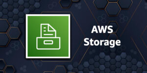
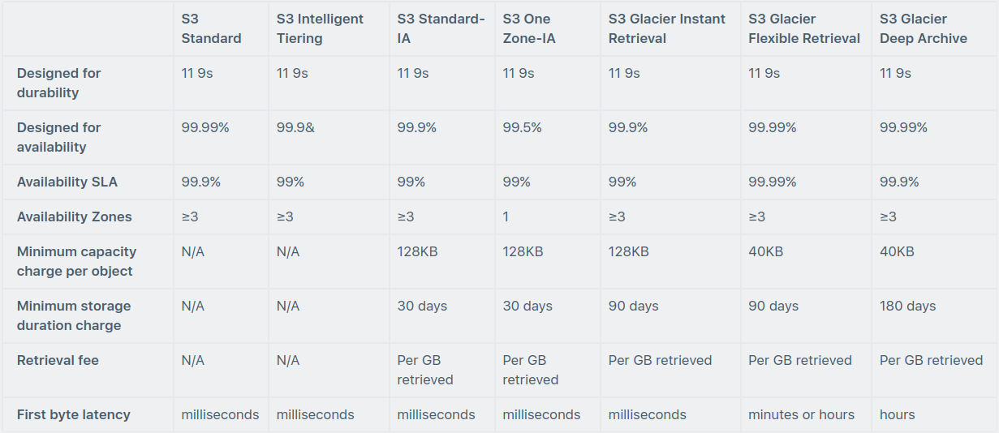
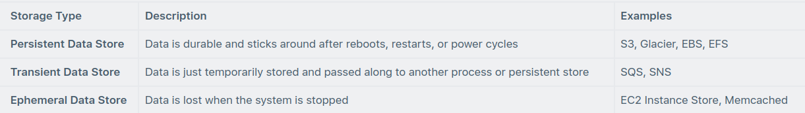

# AWS Storage Services

Within the AWS Cloud there are various service options for many different types of architectures. With regard to the
different AWS storage types of services, this cheat sheet will give you an in-depth overview on how to decide which of
the AWS storage options to choose from, and which of the AWS storage services is ideal for any particular use case.

While it may seem challenging to choose the right AWS storage service from the list of AWS storage services, this cheat
sheet will make this task manageable as it provides a succinct comparison of each AWS storage services.

This article will also discuss AWS Compute in the context of the AWS Certified Cloud Practitioner Exam. Keep in mind
that AWS Compute is one of the key technology areas covered in the exam guide.

## Amazon Simple Storage Service (S3)

Amazon S3 is object storage built to store and retrieve any amount of data from anywhere – web sites and mobile apps,
corporate applications, and data from IoT sensors or devices.

You can store any type of file in S3.

S3 is designed to deliver 99.999999999% durability, and stores data for millions of applications used by market leaders
in every industry.

S3 provides comprehensive security and compliance capabilities that meet even the most stringent regulatory
requirements.

S3 gives customers flexibility in the way they manage data for cost optimization, access control, and compliance.

Typical use cases include:

* Backup and Storage – Provide data backup and storage services for others.
* Application Hosting – Provide services that deploy, install, and manage web applications.
* Media Hosting – Build a redundant, scalable, and highly available infrastructure that hosts video, photo, or music
  uploads and downloads.
* Software Delivery – Host your software applications that customers can download.
* Static Website – you can configure a static website to run from an S3 bucket.

S3 provides query-in-place functionality, allowing you to run powerful analytics directly on your data at rest in S3.
And Amazon S3 is the most supported cloud storage service available, with integration from the largest community of
third-party solutions, systems integrator partners, and other AWS services.

Files can be anywhere from 0 bytes to 5 TB.

There is unlimited storage available.

Files are stored in buckets.

Buckets are root level folders.

Any subfolder within a bucket is known as a “folder”.

S3 is a universal namespace so bucket names must be unique globally.

There are seven S3 storage classes.

* S3 Standard (durable, immediately available, frequently accessed).
* S3 Intelligent-Tiering (automatically moves data to the most cost-effective tier).
* S3 Standard-IA (durable, immediately available, infrequently accessed).
* S3 One Zone-IA (lower cost for infrequently accessed data with less resilience).
* S3 Glacier Instant Retrieval (data that is rarely accessed and requires retrieval in milliseconds).
* S3 Glacier Flexible Retrieval (archived data, retrieval times in minutes or hours).
* S3 Glacier Deep Archive (lowest cost storage class for long term retention).

The table below provides the details of each Amazon S3 storage class:

When you successfully upload a file to S3 you receive a HTTP 200 code.

S3 is a persistent, highly durable data store.

Persistent data stores are non-volatile storage systems that retain data when powered off.

This contrasts with transient data stores and ephemeral data stores which lose the data when powered off.

The following table provides a description of persistent, transient, and ephemeral data stores and which AWS service to use:

Bucket names must follow a set of rules:

* Names must be unique across all of AWS.
* Names must be 3 to 63 characters in length.
* Names can only contain lowercase letters, numbers, and hyphens.
* Names cannot be formatted as an IP address.

Objects consist of:

* Key (name of the object).
* Value (data made up of a sequence of bytes).
* Version ID (used for versioning).
* Metadata (data about the data that is stored).

Subresources:

* Access control lists.
* Torrent.

Object sharing – the ability to make any object publicly available via a URL.

Lifecycle management – set rules to transfer objects between storage classes at defined time intervals.

Versioning – automatically keep multiple versions of an object (when enabled).

Encryption can be enabled for bucket.

Data is secured using ACLs and bucket policies.

Charges:

* Storage.
* Requests.
* Storage management pricing.
* Data transfer pricing.
* Transfer acceleration.

When you create a bucket you need to select the region where it will be created.

It is a best practice to create buckets in regions that are physically closest to your users to reduce latency.

Additional capabilities offered by Amazon S3 include: