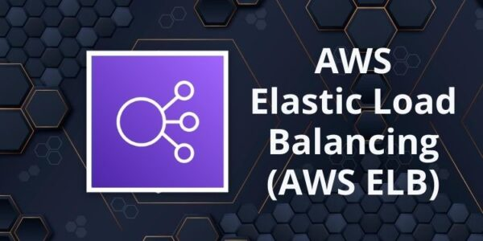
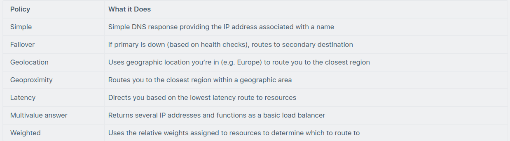
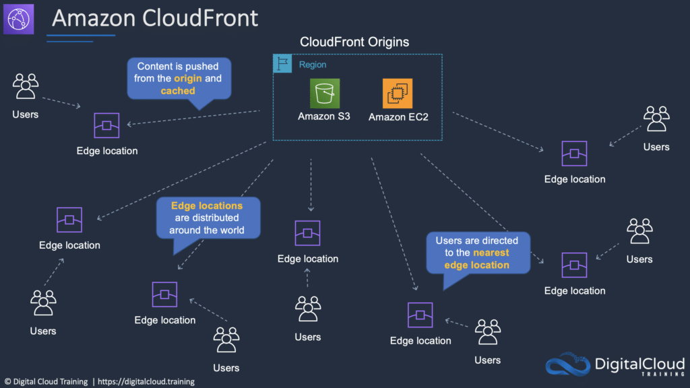

# AWS Content Delivery and DNS Services

This category of AWS services includes services for caching content around the world and providing intelligent Domain
Name System (DNS) services for your applications.

## Amazon Route 53

Amazon Route 53 is the AWS Domain Name Service.

Route 53 performs three main functions:

* Domain registration – Route 53 allows you to register domain names.
* Domain Name Service (DNS) – Route 53 translates name to IP addresses using a global network of authoritative DNS
  servers.
* Health checking – Route 53 sends automated requests to your application to verify that it’s reachable, available, and
  functional.

You can use any combination of these functions.

Route 53 benefits:

* Domain registration.
* DNS service.
* Traffic Flow (send users to the best endpoint).
* Health checking.
* DNS failover (automatically change domain endpoint if system fails).
* Integrates with ELB, S3, and CloudFront as endpoints.

Routing policies determine how Route 53 DNS responds to queries.

The following table highlights the key function of each type of routing policy:

## Amazon CloudFront

Amazon CloudFront is a content delivery network (CDN) that allows you to store (cache) your content at “edge locations”
located around the world.

This allows customers to access content more quickly and provides security against DDoS attacks.

CloudFront can be used for data, videos, applications, and APIs.

CloudFront benefits:

* Cache content at Edge Location for fast distribution to customers.
* Built-in Distributed Denial of Service (DDoS) attack protection.
* Integrates with many AWS services (S3, EC2, ELB, Route 53, Lambda).

Origins and Distributions:

* An origin is the origin of the files that the CDN will distribute.
* Origins can be either an S3 bucket, an EC2 instance, an Elastic Load Balancer, or Route 53 – can also be external (
  non-AWS).
* To distribute content with CloudFront you need to create a distribution.

CloudFront uses Edge Locations and Regional Edge Caches:

* An edge location is the location where content is cached (separate to AWS regions/AZs).
* Requests are automatically routed to the nearest edge location.
* Regional Edge Caches are located between origin web servers and global edge locations and have a larger cache.
* Regional Edge caches aim to get content closer to users.

The diagram below shows where Regional Edge Caches and Edge Locations are placed in relation to end users:

