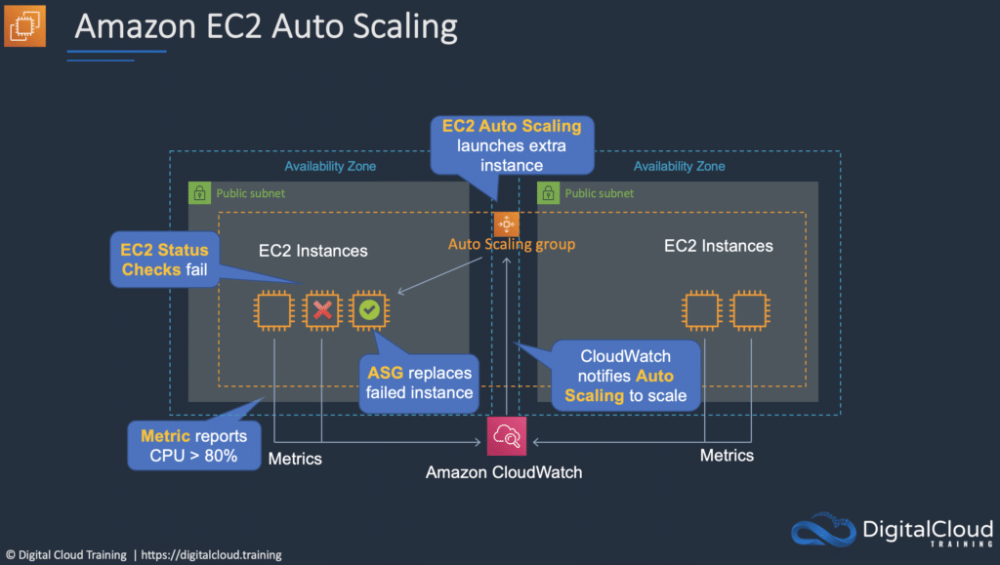
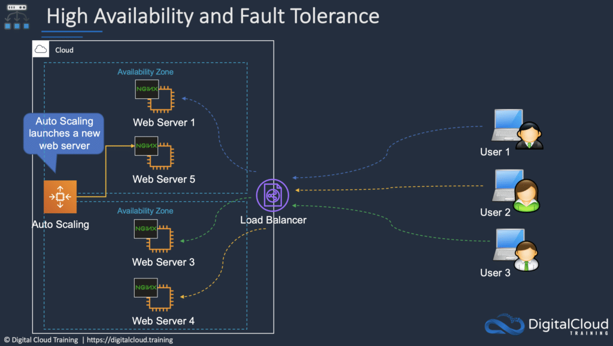

# Auto Scaling and Elastic Load Balancing

Auto Scaling and Elastic Load Balancing are features of AWS that you can use separately or together for elasticity and
high availability.

## Amazon EC2 Auto Scaling

Amazon EC2 Auto Scaling automates the process of launching (scaling out) and terminating (scaling in) Amazon EC2
instances based on the traffic demand for your application.

Auto Scaling helps to ensure that you have the correct number of EC2 instances available to handle the application load.

Amazon EC2 Auto Scaling provides elasticity and scalability.

You create collections of EC2 instances, called an Auto Scaling group (ASG).

You can specify the minimum number of instances in each ASG, and AWS Auto Scaling will ensure the group never goes
beneath this size.

You can also specify the maximum number of instances in each ASG, and the group will never go above this size.

A desired capacity can be configured, and AWS Auto Scaling will ensure the group has this number of instances.

You can also specify scaling policies that control when Auto Scaling launches or terminates instances.

Scaling policies determine when, if, and how the ASG scales and shrinks (on-demand/dynamic scaling, cyclic/scheduled
scaling).

Scaling Plans define the triggers and when instances should be provisioned/de-provisioned.

A launch configuration is the template used to create new EC2 instances and includes parameters such as instance family,
instance type, AMI, key pair, and security groups.

## Amazon Elastic Load Balancing (ELB)

ELB automatically distributes incoming application traffic across multiple targets, such as Amazon EC2 instances,
containers, and IP addresses.

ELB can handle the varying load of your application traffic in a single Availability Zone or across multiple
Availability Zones.

ELB features high availability, automatic scaling, and robust security necessary to make your applications fault
tolerant.

There are four types of Elastic Load Balancer (ELB) on AWS:

* Application Load Balancer (ALB) – layer 7 load balancer that routes connections based on the content of the request.
* Network Load Balancer (NLB) – layer 4 load balancer that routes connections based on IP protocol data.
* Classic Load Balancer (CLB) – this is the oldest of the three and provides basic load balancing at both layer 4 and
  layer 7 (not on the exam anymore).
* Gateway Load Balancer (GLB) – distributes connections to virtual appliances and scales them up or down (not on the
  exam).

### Application Load Balancer (ALB)

ALB is best suited for load balancing of HTTP and HTTPS traffic and provides advanced request routing targeted at the
delivery of modern application architectures, including microservices and containers.

Operating at the individual request level (Layer 7), Application Load Balancer routes traffic to targets within Amazon
Virtual Private Cloud (Amazon VPC) based on the content of the request.

### Network Load Balancer (NLB)

NLB is best suited for load balancing of TCP traffic where extreme performance is required.

Operating at the connection level (Layer 4), Network Load Balancer routes traffic to targets within Amazon Virtual
Private Cloud (Amazon VPC) and is capable of handling millions of requests per second while maintaining ultra-low
latencies.

Network Load Balancer is also optimized to handle sudden and volatile traffic patterns.

Related posts:

