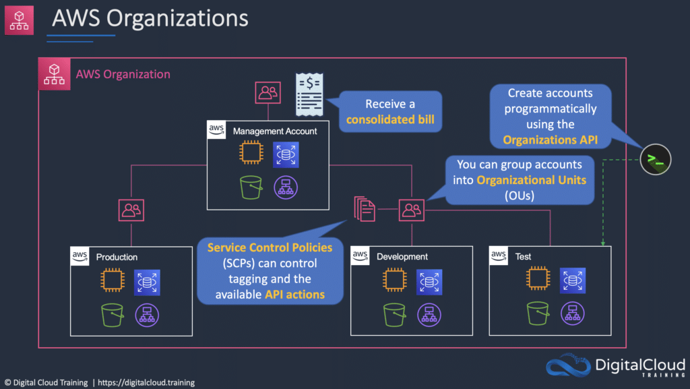

# AWS Cloud Management Services

AWS offers a suite of cloud management services designed to facilitate account management, ensure configuration
compliance, streamline application delivery, and manage systems efficiently. Here's an overview of some key AWS cloud
management services:

## 1. AWS Organizations

**Purpose:** Consolidate and centrally manage multiple AWS accounts.

- **Feature Sets:**
    - **Consolidated Billing:** Combine billing for multiple accounts.
    - **All Features:** Complete organizational management.

- **Account Types:**
    - **Paying Account:** Independent billing account.
    - **Linked Accounts:** Independently managed accounts.

## 2. AWS Control Tower

**Purpose:** Simplify the creation of multi-account environments with governance and security guardrails.

- **Integration:**
    - **Services Used:**
        - AWS Organizations, SCPs, OUs, AWS Config, AWS CloudTrail, Amazon S3, Amazon SNS, AWS CloudFormation, AWS
          Service Catalog, AWS Single Sign-On (SSO).

- **Guardrails Examples:**
    - Disallowing public write access to Amazon S3 buckets.
    - Enforcing multi-factor authentication for root user access.
    - Enabling encryption for Amazon EBS volumes.

## 3. AWS Config

**Purpose:** Provide AWS resource inventory, configuration history, and change notifications for security and
compliance.

- **Capabilities:**
    - Discover existing and deleted AWS resources.
    - Assess overall compliance against rules.
    - Track configuration changes over time.

## 4. AWS Service Catalog

**Purpose:** Create and manage catalogs of approved IT services for deployment on AWS.

- **Managed Services:**
    - Virtual machine images, servers, software, databases, multi-tier application architectures.

- **User Deployment:**
    - Enables users to deploy approved IT services quickly.

## 5. AWS Systems Manager

**Management Scope:** Manages various AWS resources, including EC2, S3, RDS, etc.

**Components:**

- **Automation:** Automate operational tasks.
- **Run Command:** Execute commands remotely.
- **Inventory:** Track system details.
- **Patch Manager:** Manage software patches.
- **Session Manager:** Securely access instances.
- **Parameter Store:** Securely store configuration data.

## 6. AWS Personal Health Dashboard

**Purpose:** Provides personalized alerts and remediation guidance for AWS service events impacting your resources.

- **Features:**
    - Proactive notifications for scheduled activities.
    - Integration with CloudWatch Events.
    - Forward-looking notifications for planned changes.

## 7. AWS Trusted Advisor

**Purpose:** Offers real-time guidance and checks to optimize AWS infrastructure according to best practices.

- **Checks Categories:**
    - Cost optimization, security, fault tolerance, performance, service limits.

- **Access Levels:**
    - Basic and Developer Support (6 security checks).
    - Business and Enterprise Support (115 checks).

## 8. AWS CloudFormation

**Purpose:** Allows description and provision of all infrastructure resources using a common language.

- **Key Features:**
    - Describe resources in a text file (JSON or YAML).
    - Provision resources automatically and securely.
    - Single source of truth for cloud environment.

